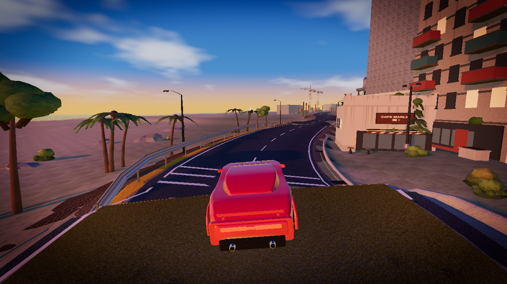
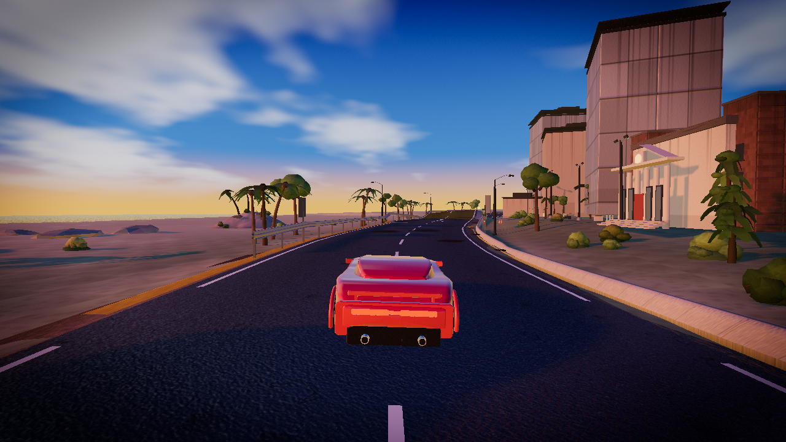
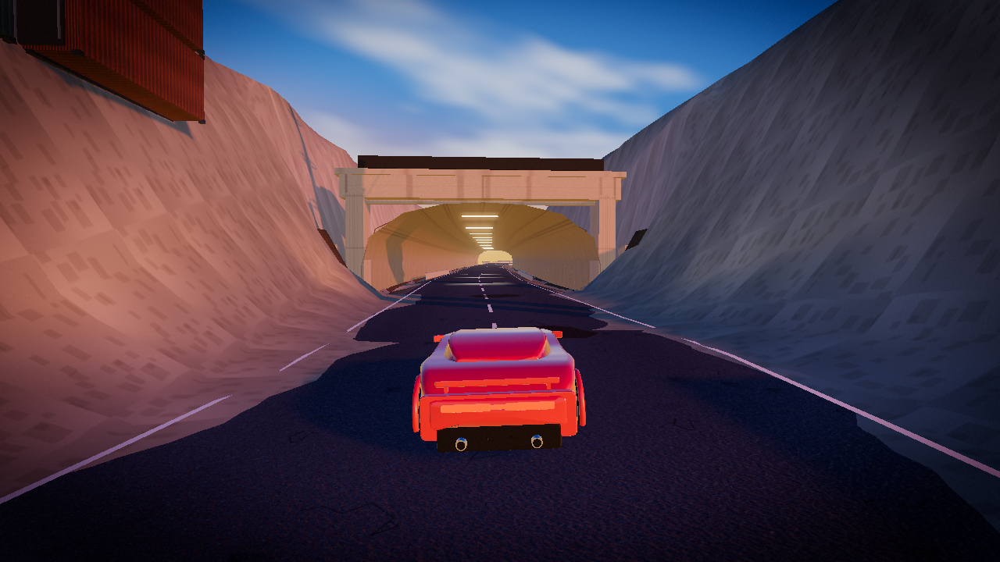
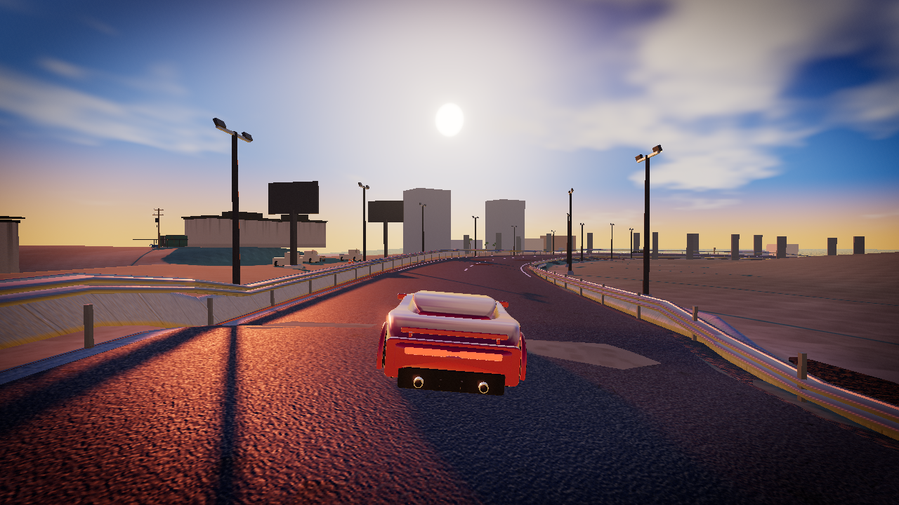
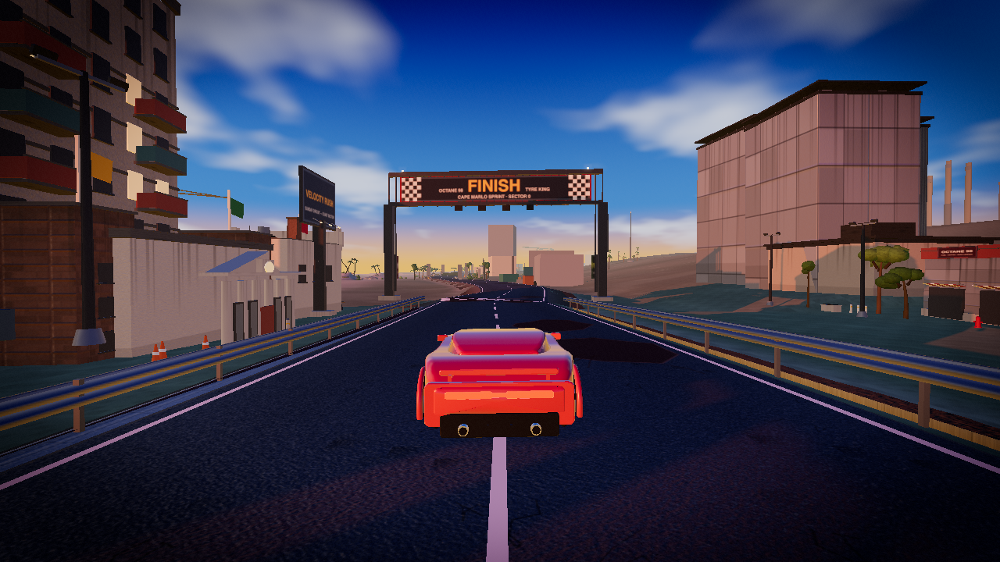

# Velocity Rush

A 3D arcade racing browser game: one track, six cars, one race. It targets
60 FPS with keyboard and gamepad input, deterministic visual evidence, and an
open-source contribution policy that ties new code to Qwen3.8-flash-next.







## Controls

| Action | Keyboard | Gamepad |
|---|---|---|
| Throttle | `W` or `↑` | Right trigger |
| Brake/reverse | `S` or `↓` | Left trigger |
| Steer | `A`/`←` and `D`/`→` | Left stick or d-pad |
| Handbrake | `Space` | LB |
| Nitro | `Shift` | RB |
| Respawn | `R` | Y |
| Pause | `P` or `Escape` | Start |
| Confirm | `Enter` | A |

## Quickstart

```bash
npm ci
npm run dev
```

Open the Vite URL printed by the development server.

## Validation

Run every gate before requesting review:

```bash
npm run test
npm run typecheck
npm run build
npm run noleak
npm run functional
npm run shots
npm run audit
```

The functional command is intentionally CPU/SwiftShader-compatible and skips
wall-clock timing gates that require a real GPU. GPU performance evidence is
collected separately with:

```bash
node scripts/perf.mjs --mode ladder --gpu --label review
node scripts/perf.mjs --mode tiers --gpu --label tiers
```

The committed `shots/` battery is the visual acceptance evidence. Maintainers
still perform manual audio-listening, physical gamepad-feel, and 5-Second
gameplay reviews before accepting a user-visible change.

## Tech stack

- Vite
- TypeScript strict mode
- Three.js `0.168.x`
- WebGL2
- Node.js test and validation harnesses
- Playwright/Chromium for deterministic screenshot capture

## Repository layout

```text
src/               game code
tests/             headless tests
scripts/         validation harnesses
shots/             committed visual battery
docs/            design and implementation documents
.github/        issue/PR templates and workflows
```

## Contributing

Read [CONTRIBUTING.md](CONTRIBUTING.md) before starting work.

New code, tests, workflows, package metadata, and assets must be authored with
`Qwen3.8-flash-next`. Documentation-only contributions can use the docs-only
declaration instead. The pull-request attestation is self-reported; maintainers
verify the declaration against the changed files and commit evidence. Existing
commit history is grandfathered under this policy.

## License

Velocity Rush is released under the [MIT License](LICENSE).
